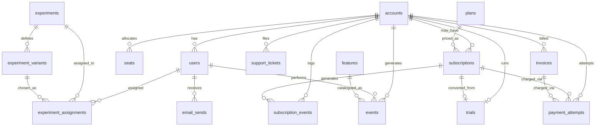

# `saas` Schema Dictionary

*Owner: Sidharth Menon 
---

## 0. Six Probe Questions

**1. What is the grain of `subscriptions`?**
Brief's hint: "self_serve → user-grain (`user_id` set, `seat_count = 1`); b2b → account-grain (`user_id` NULL)." Confirmed exactly, no exceptions: self_serve (2,000 rows) is 100% user-grain — every row has `user_id` set and `seat_count = 1`. b2b (113 rows) is 100% account-grain — every row has `user_id` NULL, `account_id` set, `seat_count` averaging 7.83. 113 + 2,000 = 2,113, the full table.

**2. How is MRR stored?**
`subscriptions.mrr` (current-state) and `subscription_events.mrr_delta` (movement log) are separate columns that coexist. Reconciling `SUM(mrr_delta)` per subscription against `mrr`: 1,385 of 2,113 (65.5%) tie out exactly; 728 (34.5%) show a real gap (avg 57.66, max 1,117.2) — cause not verified.

**3. What `status` values exist on `subscriptions`, with counts?**
5 values, summing to the full 2,113 rows: `active` (885), `churned` (557), `trialing` (292), `past_due` (195), `paused` (184). One correction to the brief: the real value is `churned`, not `cancelled` as guessed.

**4. How do you identify a trial vs. a paid subscription?**
A non-null `converted_at` + `converted_subscription_id` on `trials` marks a conversion, pointing at the resulting `subscriptions` row (0 orphans on that join). 113 of 250 trials (45.2%) converted; the other 137 lapsed.

**5. What timezone are timestamp columns in?**
Mixed, not uniform. `timestamp with time zone`: `accounts.signup_date`, `email_sends.sent_at/opened_at/clicked_at`, `seats.activated_at/deactivated_at`, `support_tickets.opened_at/closed_at`, `trials.started_at/ends_at/converted_at`. `timestamp without time zone`: `events.occurred_at`, `experiments.start_date/end_date`, `experiment_assignments.assigned_at`, `invoices.issued_date/paid_date/due_date`, `payment_attempts.attempted_at`, `signups.signup_date`, `subscriptions.start_date/end_date/cancelled_at`, `subscription_events.event_time`, `users.signup_date/last_login_date`. Any join/comparison mixing the two groups needs an explicit cast.

**6. Is there a soft-delete pattern?**
No. Scanned all 160 columns across all 24 tables — no `deleted_at`, `is_deleted`, `archived_at`, or equivalent anywhere.

---

## A. Table Inventory

| Table | Approx rows | What it stores | Grain |
|---|---|---|---|
| `accounts` | 1,250 | Paying company/account master — name, type (self_serve/b2b), industry, size, country, signup date, acquisition channel | One row per account |
| `plans` | 8 | Pricing catalog — 4 tiers × 2 billing intervals; annual price is exactly 10× monthly for every paid tier | One row per (plan_name, billing_interval) |
| `users` | 2,556 | People inside an account — role, plan_type (60.9% null, case-drifted), signup/login activity | One row per user |
| `subscriptions` | 2,113 | Plan attached to a user (self_serve) or account (b2b) — plan, status, mrr, seat_count | One row per subscription |
| `subscription_events` | 3,741 | Event log of subscription lifecycle — 7 event types | One row per event |
| `trials` | 250 | Trial period per account — 14-day window, converts to a subscription 45.2% of the time | One row per trial |
| `seats` | 1,556 | Seat assignments within an account | One row per seat assignment |
| `invoices` | 4,201 | Billed amounts per period — 4 statuses, some negative amounts | One row per invoice |
| `payment_attempts` | 5,690 | Every charge attempt against an invoice | One row per charge attempt |
| `events` | 53,534 | Product telemetry — 8 event types | One row per event |
| `features` | 50 | Product feature catalog — 10 categories × 5 features each | One row per feature |
| `support_tickets` | 1,249 | Support ticket per account | One row per ticket |
| `email_sends` | 3,385 | Lifecycle/dunning/re-engagement email log | One row per email send |
| `experiments` | 4 | Product experiment definitions — all 4 concluded | One row per experiment |
| `experiment_variants` | 8 | Two variants per experiment, ~50/50 split | One row per variant |
| `experiment_assignments` | 3,200 | User-to-variant assignment | One row per (experiment, user) assignment |
| `signups` | 2,556 | **View** — 4-column signup summary per user, derived from `users` | One row per user |
| `legacy_companies` | 200 | Pre-migration company master. Out of scope. | One row per legacy company |
| `legacy_events` | 15,028 | Pre-migration event log — 20 event types. Out of scope. | One row per legacy event |
| `legacy_invoices` | 1,500 | Pre-migration invoices. Out of scope. | One row per legacy invoice |
| `legacy_subscriptions` | 500 | Pre-migration subscriptions. Out of scope. | One row per legacy subscription |
| `legacy_support_tickets` | 300 | Pre-migration tickets. Out of scope. | One row per legacy ticket |

> The query only returned 5 `legacy_*` tables — narrower than the brief implied. No `legacy_users`, `legacy_plans`, `legacy_payment_attempts`, `legacy_seats`, or `legacy_experiments`. Still out of scope either way. `legacy_events` (15,028 rows) is unusually large for a legacy table — worth checking whether it's still being written to.

---

## B. Per-Column Notes

### `accounts` (1,250)
- `account_id` — **PK** (bigint).
- `name` — text, e.g. `NetPulse`.
- `account_type` — `self_serve` / `b2b`.
- `industry` — text, nullable.
- `employee_count` — integer.
- `country` — text.
- `signup_date` — timestamptz.
- `acquisition_channel` — text, e.g. `organic`.

### `plans` (8)
- `plan_id` — **PK**.
- `plan_name` — `free` / `starter` / `pro` / `enterprise`.
- `monthly_price` — 0 / 29 / 99 / 399.
- `seat_limit` — 2 / 10 / 50 / 1,000.
- `billing_interval` — `monthly` / `annual`. Annual price is exactly 10× monthly for every paid tier (2 months free built in).

### `users` (2,556)
- `user_id` — **PK**.
- `email` — text.
- `company_name` — text.
- `signup_date` — timestamp.
- `signup_source` — `team_invite` (1,306) / `signup` (250) / `google_ads` (158) / `referral` (157) / null (148, 5.8%) / `direct` (144) / `organic` (140) / `product_hunt` (134) / `linkedin` (119).
- `plan_type` — 60.9% null. Case-drifted: `pro` (209) / `Pro` (89) / `professional` (49) — one tier; `enterprise` (148) / `Enterprise` (169) — one tier; plus `free` (200), `starter` (136).
- `is_active` — integer (0/1), not boolean. 2,310 active / 246 inactive.
- `last_login_date` — timestamp, 2.7% null.
- `account_id` — **FK → accounts**. 1,250 distinct values (every account has ≥1 user).
- `role` — `owner` (1,250, exactly one per account) / `member` (876) / `admin` (430).

### `subscriptions` (2,113)
- `subscription_id` — **PK**.
- `user_id` — **FK → users**, nullable — null for b2b, set for self_serve. 5.3% null (113 rows = the full b2b set).
- `plan` — case-drifted: `pro` (348) / `Pro` (282) / `professional` (294) — one tier; `enterprise` (287) / `Enterprise` (285) — one tier; plus `starter` (347), `free` (270).
- `start_date` — timestamp. The brief called this `started_at` — that column doesn't exist.
- `end_date` — timestamp, 22.1% null.
- `mrr` — numeric. Reconciles exactly against `SUM(subscription_events.mrr_delta)` for only 65.5% of rows (see §E).
- `status` — `active` (885) / `churned` (557) / `trialing` (292) / `past_due` (195) / `paused` (184).
- `cancelled_at` — timestamp, populated exactly for the 557 churned rows.
- `cancellation_reason` — null for 100% of non-churned rows; among churned rows only, 15.8% null. Reasons: missing_features (99) / poor_support (82) / too_expensive (77) / budget_cuts (73) / switched_competitor (71) / no_longer_needed (67).
- `account_id` — **FK → accounts**, nullable — set for b2b, reachable via `user_id → users.account_id` for self_serve.
- `seat_count` — 94.9% of rows are exactly 1 (self_serve grain); b2b rows average 7.83.
- `plan_id` — **FK → plans**, 11.5% null. Only 4 of 8 `plan_id` values ever referenced.

### `subscription_events` (3,741)
- `event_id` — **PK**, not named in the brief.
- `subscription_id` — **FK → subscriptions**.
- `user_id` — integer.
- `event_type` — `subscription_started` (2,000) / `trial_started` (592) / `cancelled` (557) / `plan_changed` (336) / `seat_add` (129) / `trial_converted` (113) / `addon_attach` (14).
- `event_time` — timestamp. 174 rows are future-dated (after 2026-07-31): 136 `cancelled`, 38 `plan_changed`.
- `from_plan` — populated only for `cancelled`+`plan_changed` events (893 rows), null otherwise.
- `to_plan` — populated for most event types; `= 'priority_support'` exactly on the 14 `addon_attach` rows (doubles as an add-on name field there).
- `mrr_delta` — numeric.
- `account_id` — bigint.
- `actor_user_id` — integer.
- `seats_delta` — 93.5% null.

### `trials` (250)
- `trial_id` — **PK**.
- `account_id` — **FK → accounts**, 1:1 (every trial maps to exactly one account).
- `started_at` / `ends_at` — timestamptz. Exactly a 14-day window in every row seen (9-row sample).
- `converted_at` — timestamptz, null for lapsed trials.
- `converted_subscription_id` — **FK → subscriptions**, non-null for 113 of 250 (45.2%) — the trial-to-paid conversion rate.

### `seats` (1,556)
- `seat_id` — **PK**.
- `account_id` — bigint; only seen in the b2b (200,000+) account range in the sample.
- `user_id` — integer.
- `activated_at` / `deactivated_at` — timestamptz; `deactivated_at` null on every row seen (8-row sample).

### `invoices` (4,201)
- `invoice_id` — **PK**.
- `user_id` — 28.6% null (billed at account level for b2b).
- `subscription_id` — integer.
- `amount` — numeric, **goes negative** (min -597.60, mean 446.67, median 156.03, max 7,182).
- `status` — `paid` (3,082) / `overdue` (511) / `refunded` (310) / `void` (298).
- `issued_date` / `due_date` — timestamp.
- `paid_date` — null exactly for `overdue`+`void` rows, as expected; but 91 `paid` rows also have a null `paid_date` (90 of those on b2b accounts) — a real anomaly.
- `account_id` — 1,062 distinct (85% of accounts billed).

### `payment_attempts` (5,690)
- `attempt_id` — **PK**.
- `invoice_id` — **FK → invoices**. `attempt_number = 1` occurs exactly 4,201 times — every invoice has ≥1 attempt.
- `user_id` — integer.
- `subscription_id` — **FK → subscriptions**, only 113 distinct non-null values (the same 113 as the trial-conversion/b2b set); 76.2% null otherwise.
- `amount` — numeric.
- `status` — `succeeded` (3,397) / `failed` (2,293).
- `failure_reason` — populated exactly for the 2,293 failed rows: card_declined (544) / insufficient_funds (485) / expired_card (447) / authentication_required (418) / fraud_blocked (399).
- `attempt_number` — 1 (4,201) / 2 (986) / 3 (397) / 4 (106).
- `attempted_at` — timestamp.
- `account_id` — bigint.

### `events` (53,534)
- `event_id` — **PK**.
- `user_id` — 0.98% null.
- `event_type` — `login` (17,898) / `feature_use` (10,891) / `dashboard_view` (9,187) / `api_call` (5,428) / `export` (3,740) / `settings_change` (2,753) / `invite_sent` (2,344) / `report_view` (1,293).
- `occurred_at` — timestamp.
- `properties` — 94.3% null; JSON text, populated only for `api_call` and `feature_use` events (e.g. `{"endpoint": "/api/v1/reports", "method": "PUT"}`, `{"feature": "integrations"}`).
- `account_id` — 1.06% null; **306 orphan rows** referencing invalid account_ids (see §E).
- `feature_id` — **FK → features**, 82.5% null; populated only for `feature_use` events (9,371 of 10,891). All 50 features referenced at least once.

### `features` (50)
- `feature_id` — **PK**.
- `feature_name` — text, unique.
- `category` — 10 categories × 5 features each: core, analytics, integrations, security, data, collaboration, customization, workflow, platform, support.
- `release_date` — timestamp, Mar 2022 – Dec 2025.

### `support_tickets` (1,249)
- `ticket_id` — **PK**.
- `account_id` — bigint.
- `opened_by_user_id` — integer.
- `opened_at` / `closed_at` — timestamptz.
- `priority` — critical / low / medium / high (all seen across samples).
- `category` — billing / technical / onboarding / feature_request / bug_report.
- `csat` — integer; not always populated even on closed tickets (seen in an 8-row sample).

### `email_sends` (3,385)
- `send_id` — **PK**.
- `user_id` — integer.
- `campaign_name` — versioned, e.g. `lifecycle_v2`, `dunning_v1`.
- `send_type` — `reengagement` / `dunning` / `lifecycle` (seen in sample).
- `sent_at` / `opened_at` / `clicked_at` — timestamptz.

### `experiments` (4)
- `experiment_id` — **PK**.
- `name` — Trial Length 14 vs 7 / Annual Discount Prompt / Onboarding Checklist / Pricing Page Redesign.
- `start_date` / `end_date` — timestamp, each experiment runs ~1 month.
- `hypothesis` — templated text, not distinct per experiment.
- `owner` — `product-team` on all 4 rows.
- `status` — `concluded` on all 4 rows.

### `experiment_variants` (8)
- `variant_id` — **PK**.
- `experiment_id` — **FK → experiments**, exactly 2 variants per experiment.
- `variant_name` — e.g. `14_day`/`7_day`, `no_prompt`/`shown_prompt`, `hidden`/`visible`, `v1`/`v2`.
- `allocation_pct` — 50 on every row.
- `is_control` — true on only 1 of 8 rows total (experiment 1's `14_day` variant); false everywhere else, including experiments 2–4.

### `experiment_assignments` (3,200)
- `assignment_id` — **PK**.
- `experiment_id` — **FK → experiments**, exactly 800 per experiment.
- `user_id` — integer, 1,000 distinct across all 3,200 rows (avg 3.2 assignments per user).
- `variant` — text, matches `variant_id` 100% of the time (0 mismatches).
- `assigned_at` — timestamp.
- `variant_id` — **FK → experiment_variants**, 389–411 rows per variant (not an exact 400/400 split).

### `signups` (2,556) — VIEW
- `user_id` / `account_id` / `signup_date` / `signup_source` — a 4-column view over `users`; confirmed row-for-row identical to the corresponding `users` row on the one sampled record.

### `legacy_companies` (200)
- `id` — **PK**.
- `name`, `industry` (6 values), `employee_count`, `signup_date` (date, no time component), `country` (6 values) — all NOT NULL.

### `legacy_events` (15,028)
- `id` — **PK**.
- `company_id` — integer.
- `event_type` — 20 distinct values, richer than the live `events` table's 8: export, api_call, feature_use, settings_change, import, report_view, login, invite_user, search_performed, alert_triggered, permission_change, billing_view, file_upload, comment_created, integration_setup, dashboard_view, data_sync, webhook_received, api_key_created, user_provisioned.
- `event_date` — date, Oct 2024 – Apr 2026.
- `properties` — jsonb, 55.7% null.

### `legacy_invoices` (1,500)
- `id` — **PK**.
- `company_id`, `subscription_id` — integer.
- `amount` — numeric, 0–1,020.14, **no negative values** (unlike live `invoices`).
- `status` — `paid` (1,418) / `overdue` (43) / `void` (39) — only 3 values, no `refunded`.
- `issued_date` / `paid_date` — date.

### `legacy_subscriptions` (500)
- `id` — **PK**.
- `company_id` — integer.
- `plan` — `pro` (189) / `enterprise` (139) / `starter` (117) / `free` (55) — **no case drift**, unlike live `subscriptions.plan`.
- `start_date` / `end_date` — date.
- `mrr` — numeric.
- `status` — `active` (316) / `churned` (153) / `trial` (18) / `paused` (13) — note `trial` not `trialing`, and no `past_due`.
- `cancelled_at` — timestamp, nullable.
- `cancellation_reason` — populated only on churned rows; 30.7% null there (closer to the brief's ~31% guess than the live table's actual 15.8%).

### `legacy_support_tickets` (300)
- `id` — **PK**.
- `company_id` — integer.
- `subject` — text.
- `priority` — `high` (107) / `medium` (84) / `critical` (69) / `low` (40).
- `status` — `resolved` (125) / `closed` (92) / `open` (49) / `in_progress` (34) — a column the live `support_tickets` table doesn't have at all.
- `created_at` / `resolved_at` — timestamp; `resolved_at` populated exactly for closed+resolved rows.
- `category` — technical / billing / bug_report / feature_request / onboarding.

---

## C. Verified Relationships (orphan-checked)

Every relationship below was confirmed by a left-join orphan count. `saas` declares **no formal foreign keys** — these are *soft* FKs verified against the data.

| Parent | Child | Join column | Cardinality | Orphans |
|---|---|---|---|---|
| accounts | users | account_id | 1:M | 0 |
| accounts | subscriptions | account_id | 1:M | 0 |
| subscriptions | subscription_events | subscription_id | 1:M, fully reconciled | 0 |
| accounts | subscription_events | account_id | 1:M | 0 |
| plans | subscriptions | plan_id | 1:M, only 4 of 8 referenced | 0 |
| accounts | trials | account_id | 1:1 | 0 |
| subscriptions | trials | subscription_id ← converted_subscription_id | 113 of 250 converted (45.2%) | 0 |
| features | events | feature_id | 1:M, all 50 referenced | 0 |
| users | events | user_id | 1:M | **40** |
| accounts | seats | account_id | 1:M | 0 |
| accounts | invoices | account_id | 1:M, 85% of accounts billed | 0 |
| accounts | support_tickets | account_id | 1:M, 18% of accounts filed a ticket | 0 |
| accounts | payment_attempts | account_id | 1:M | 0 |
| accounts | events | account_id | 1:M | **306** |
| users | experiment_assignments | user_id | 1:M | 0 |
| users | email_sends | user_id | 1:M, 89.5% of users emailed | 0 |
| invoices | payment_attempts | invoice_id | 1:M, fully reconciled | 0 |
| subscriptions | payment_attempts | subscription_id | 1:M, same 113 as trial conversions | 0 |
| experiments | experiment_variants | experiment_id | 1:M, exactly 2 per experiment | 0 |
| experiments | experiment_assignments | experiment_id | 1:M, exactly 800 per experiment | 0 |
| experiment_variants | experiment_assignments | variant_id | 1:M, 389–411 per variant | 0 |

*Note: `events.account_id`'s 306 orphans have `distinct_parent_refs` (1,448) exceeding the real account count (1,250) — at least ~198 distinct invalid account IDs are floating around in `events`.*

---

## D. ER Diagram

---

## E. Things That Surprised Me

- **No declared foreign keys at all.** Every relationship in §C is a soft FK, individually orphan-checked — 19 clean, 2 with real orphans (below). Same pattern as `ecom` in Week 1.
- **Plan-name case drift on both `users.plan_type` and `subscriptions.plan`.** `plan_type`: pro/Pro/professional (one tier), enterprise/Enterprise (one tier), plus free, starter, and 60.9% null. `subscriptions.plan`: same tiers, no nulls this time. `LOWER()` before grouping either column.
- **`subscriptions.status` actual value is `churned`, not `cancelled`** as the brief guessed — 5 confirmed values: active (885), churned (557), trialing (292), past_due (195), paused (184).
- **`subscriptions.cancellation_reason` is 15.8% null on churned rows, not the brief's ~31% guess.** Interestingly, `legacy_subscriptions.cancellation_reason` is 30.7% null on its churned rows — much closer to the brief's figure, suggesting the brief's estimate may actually describe the legacy table.
- **`subscriptions.plan_id` is 11.5% null, not the brief's ~9% guess.** Only 4 of 8 `plans` rows are ever referenced.
- **174 future-dated `subscription_events.event_time` rows, not the brief's ~234 guess** — 136 cancelled, 38 plan_changed, verified with 0 date-parse failures.
- **`subscriptions` grain is a clean split by account type.** self_serve (2,000 rows) is 100% user-grain (user_id set, seat_count = 1); b2b (113 rows) is 100% account-grain (user_id null, seat_count varies, avg 7.83). No exceptions across all 2,113 rows.
- **`subscriptions.mrr` reconciles exactly against `SUM(subscription_events.mrr_delta)` for only 65.5% of rows.** 728 of 2,113 show a real gap (avg 57.66, max 1,117.2) — cause not verified.
- **`invoices.amount` goes negative** — min -597.60 (mean 446.67, median 156.03, max 7,182). A naive `SUM(amount)` would silently net these out.
- **91 `invoices` rows are `status = 'paid'` but have a null `paid_date`** — 90 of those on b2b accounts, almost exclusive to that segment.
- **306 orphan rows in `events.account_id`, a new finding the brief never mentioned.** Worse than the 40-orphan `events.user_id` issue (which matches the brief's estimate exactly) — `distinct_parent_refs` (1,448) exceeds the real account count (1,250).
- **`experiment_variants.is_control = true` appears only once across all 8 rows** (experiment 1 only) — experiments 2–4 have no flagged control variant at all.
- **`experiment_assignments` variant split is 389–411 per variant, not an exact 400/400.** `variant` text and `variant_id` do always agree, though (0 mismatches).
- **No soft-delete columns anywhere.** Scanned all 160 columns across all 24 tables — no `deleted_at`/`is_deleted`/`archived_at` or equivalent.
- **Legacy vs. live divergence on several columns.** `legacy_subscriptions.plan` has no case drift (live does); `legacy_invoices.amount` has no negatives (live does); `legacy_invoices.status` has only 3 values, no `refunded` (live has 4); `legacy_support_tickets` has a `status` column live `support_tickets` lacks entirely.
